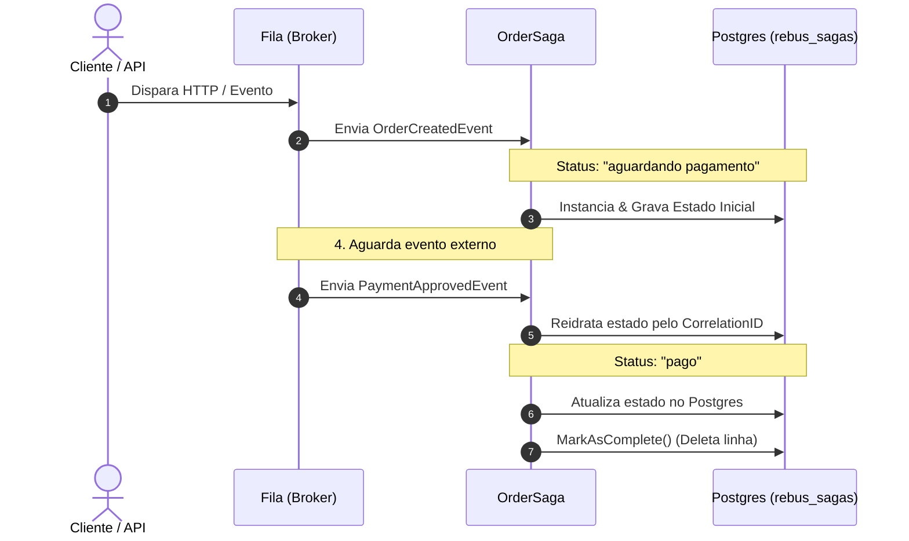
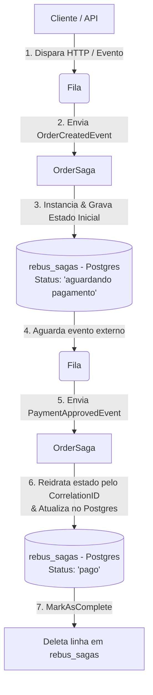

# Casos de Estudo RabbitMQ/Rebus

## Abstract

Este projeto apresenta um estudo prático da integração entre RabbitMQ e Rebus em uma arquitetura orientada a eventos. O exemplo utiliza uma saga de pedidos para demonstrar o processamento assíncrono de mensagens, a correlação entre eventos, a persistência e a reidratação do estado no PostgreSQL, além do tratamento de falhas e do encaminhamento de mensagens para a fila de erro. O objetivo é tornar visíveis os principais conceitos e decisões envolvidos na implementação de processos distribuídos e de longa duração com .NET.

## Fluxo Saga

Em arquiteturas orientadas a eventos usando Rebus com Sagas, a saga funciona como um Orquestrador de Estado Persistente. Ela é uma máquina de estados que reage a mensagens da fila, grava o progresso no banco e decide o que fazer a seguir.

Aqui está o fluxo completo, ponta a ponta:

```text
[ Cliente / API ]
       │
       │ 1. Dispara HTTP / Evento
       ▼
 ┌───────────┐       2. Envia OrderCreatedEvent       ┌───────────────┐
 │   Fila    ├───────────────────────────────────────►│  OrderSaga    │
 └───────────┘                                        └───────┬───────┘
                                                              │
                                                              │ 3. Instancia & Grava Estado Inicial
                                                              ▼
                                                     ┌─────────────────┐
                                                     │   rebus_sagas   │ (Postgres)
                                                     │ Status:         │
                                                     │ "aguardando     │
                                                     │  pagamento"     │
                                                     └────────┬────────┘
                                                              │
                                                              │ 4. Aguarda evento externo
                                                              ▼
 ┌───────────┐       5. Envia PaymentApprovedEvent    ┌───────────────┐
 │   Fila    ├───────────────────────────────────────►│  OrderSaga    │
 └───────────┘                                        └───────┬───────┘
                                                              │
                                                              │ 6. Reidrata estado pelo CorrelationID
                                                              │    & Atualiza no Postgres
                                                              ▼
                                                     ┌─────────────────┐
                                                     │   rebus_sagas   │
                                                     │ Status:         │
                                                     │ "pago"          │
                                                     └────────┬────────┘
                                                              │
                                                              │ 7. MarkAsComplete()
                                                              ▼
                                                     ┌─────────────────┐
                                                     │ Deleta linha em │
                                                     │  rebus_sagas    │
                                                     └─────────────────┘
```

### Diagrama de Sequência



### Diagrama Top-Down



## O Ciclo de Vida em 4 Passos

### 1. Início da Saga (`IAmInitiatedBy<OrderCreatedEvent>`)
* **O que acontece:** A mensagem de criação do pedido chega na fila.
* **O Rebus faz:** Cria um novo registro na tabela `rebus_sagas` no Postgres, contendo um JSON com os dados do processo (`OrderSagaData`).
* **Estado no banco:** A propriedade no JSON fica como `"aguardando pagamento"`. O Rebus salva a correlação (ex: `OrderId`) para saber como achar essa saga no futuro.
* **Ação:** A saga pode disparar um comando externo (ex: solicitar cobrança no gateway) e para de executar. O processo morre na memória e fica só gravado no banco.

### 2. O Período de Espera (Standby)
* A mensagem inicial já foi processada e removida da fila.
* O sistema não gasta CPU nem conexões. A ordem está em descanso dentro da tabela `rebus_sagas`.

### 3. Reidratação e Avanço (`IHandleMessages<PaymentApprovedEvent>`)
* **O que acontece:** Horas ou segundos depois, o gateway envia um webhook e sua aplicação joga o evento `PaymentApprovedEvent` na fila.
* **O Rebus faz:** 
  1. Lê a mensagem e pega o `OrderId`.
  2. Vai até a tabela `rebus_sagas`, busca a linha correlacionada a esse `OrderId`.
  3. Reidrata a saga na memória exatamente com o estado gravado antes (`"aguardando pagamento"`).
* **Ação:** A saga executa o método que trata a aprovação. Atualiza o status interno do JSON para `"pago"` e salva de volta na `rebus_sagas`.

### 4. Finalização (`MarkAsComplete()`)
* Quando a saga cumpre todo o ciclo (pedido entregue ou cancelado), o código chama `MarkAsComplete()`.
* **O Rebus faz:** Apaga a linha correspondente da tabela `rebus_sagas`. A tabela serve apenas para sagas em andamento; saga finalizada não deve ocupar espaço lá.

## O papel de cada peça

### 1. A Fila de error (a DLQ do Rebus)
* **Onde fica**: No broker de mensageria (ex: uma queue chamada error no RabbitMQ).
* **Como funciona**: Se um handler (ou saga) lança uma exceção não tratada ao processar uma mensagem, o Rebus aplica a regra de retentativas (retries).
* **O desfecho**: Se falhar por $N$ vezes seguidas (o padrão do Rebus são 5 tentativas), o Rebus desiste, tira a mensagem da fila original e faz o Publish/Send dessa mensagem exatamente para a fila chamada error no broker.

### 2. A Tabela rebus_sagas (o Storage do Rebus)
* **Onde fica**: No PostgreSQL.Como funciona: Guarda apenas os dados de negócio necessários para a saga lembrar onde parou (ex: {"Status": "aguardando pagamento", "OrderId": 123}).
* **O que acontece no erro**: Se a mensagem estoura o limite de erros e vai para a fila de `error`, a transação no banco sofre Rollback. A tabela `rebus_sagas` continua com a foto do último estado válido e não é alterada.

### Resumo do Comportamento
* A fila de `error` é o cemitério de mensagens (Dead Letter Queue) mantido no Broker.
* A tabela `rebus_sagas` é o bloco de notas do estado mantido no Banco.

Se a sua mensagem foi parar na fila de error, você precisa ir no painel do seu broker (ou via CLI/Rebus Fleet Manager) para inspecionar o payload e o stack trace do erro gravado nos cabeçalhos (headers) dessa mensagem.


## Execução

```bash
git clone https://github.com/avmesquita/rabbitmq-rebus-study-case.git
cd rabbitmq-rebus-study-case
chmod +x start.sh
./start.sh
```


