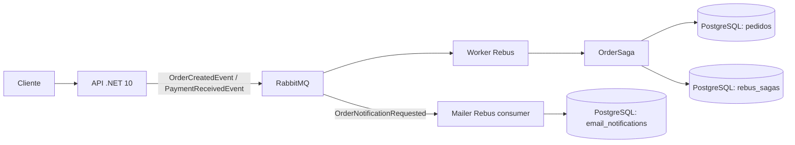

# Arquitetura

## Visão Geral



## Dependências

```text
api/src
  -> shared/StudyCase.Contracts
  -> shared/StudyCase.Domain

worker/src
  -> shared/StudyCase.Contracts
  -> shared/StudyCase.Domain
  -> Rebus + RabbitMQ + PostgreSQL

mailer/src
  -> shared/StudyCase.Contracts
  -> shared/StudyCase.Domain
  -> Rebus + RabbitMQ + PostgreSQL
```

## Responsabilidades

### API

A API é a fronteira HTTP. Ela valida a entrada, cria a entidade `Order` e publica mensagens. Não conhece `OrderSaga`, `OrderSagaData` ou detalhes de persistência do worker.

Endpoints atuais:

- `GET /health`
- `POST /orders`
- `POST /orders/{orderId}/payment`

### Contracts

`StudyCase.Contracts` contém somente mensagens compartilhadas entre processos. Os tipos precisam permanecer estáveis e usar o mesmo namespace e assembly nos produtores e consumidores.

### Domain

`StudyCase.Domain` contém o modelo de negócio reutilizável, atualmente a entidade `Order`. Não deve depender de Rebus, RabbitMQ, PostgreSQL ou ASP.NET.

### Worker

O worker configura transporte, roteamento, storage da saga e handlers. `OrderSaga` correlaciona ambos os eventos por `OrderId`, grava o pedido e completa a saga após o pagamento.

### Mailer

O Mailer é um processo independente Rebus. A API envia `OrderNotificationRequested` para `mailer-queue`, e `NotificationDispatcher` processa a mensagem e grava a notificação de forma idempotente.

O dispatcher atual representa a fronteira de integração com e-mail, mas ainda registra/loga o processamento em vez de chamar SMTP ou um provedor externo. A implementação do provedor deve ficar atrás desse handler.

## Mensageria

- Fila de entrada do worker: `pedidos-queue`.
- Fila da API: `api-queue`.
- Eventos publicados pela API são roteados para `pedidos-queue`.
- Falhas de processamento devem ser investigadas na fila de erro do Rebus.

## Persistência

- `pedidos`: dados de negócio do pedido.
- `rebus_sagas`: estado serializado das sagas em andamento.
- `rebus_saga_indexes`: índices de correlação do Rebus.
- `email_notifications`: controle idempotente das notificações processadas pelo Mailer.

A persistência do estado da saga não substitui a persistência do pedido. São responsabilidades distintas.
